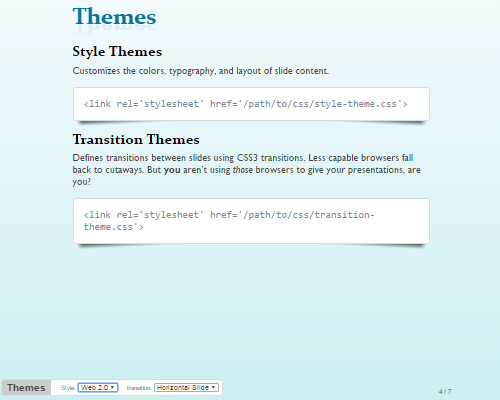

# deck.js - Slide Show (S9) Template Pack

## Live Preview



See [`slides.html`](http://slideshow-templates.github.io/slideshow-deck.js/slides.html).

## What's Slide Show (S9)?

A Ruby gem that lets you create slide shows and author slides in plain text
using a wiki-style markup language that's easy-to-write and easy-to-read.
More [Slide Show (S9) Project Site »](http://slideshow-s9.github.io)

## Intro

The [deck.js](https://github.com/imakewebthings/deck.js) package
by Caleb Troughton (aka imakewebthings) bundled up into 
a Slide Show (S9) template pack lets you author your slides
in a wiki-style markup language (that is, Markdown or Textile) plus
lets you use text filters and helpers for adding comments, macros,
includes, syntax highlighters and much more.

Note, the deck.js template pack is configured to use
the following headers in `slides.html.erb`:

    author: Your Name Here
    title: Your Slide Show Title Here
 

## Try It Yourself - How To Use the deck.js Template Pack

If you want to try it yourself, install (fetch) the new template pack. Issue the command:

    $ slideshow install deck.js

Or as an alternative clone the template pack using `git`. Issue the commands:

    $ cd ~/.slideshow/templates
    $ git clone https://github.com/slideshow-templates/slideshow-deck.js.git

To check if the new template got installed, use the `list` command:

    $ slideshow list

Listing something like:

    Installed templates include:
       deck.js (~/.slideshow/templates/deck.js/deck.js.txt)

Tip: To get started use the included quick starter sample. Issue the command:

    $ slideshow new -t deck.js

Now you will have a copy of the deck.js Quick Starter sample
(that is, [`deck.js.text`](https://raw.github.com/slideshow-templates/slideshow-deck.js/master/sample.md))
in Markdown in your working folder.

```
title: Getting Started with deck.js
author: Caleb Troughton

## How to Make a Deck

1. ### Write Slides
   Slide content is simple HTML.
2. ### Choose Themes
   One for slide styles and one for deck transitions.
3. ### Include Extensions
   Add extra functionality to your deck, or leave it stripped down.


## The Markup

Slides are just HTML elements with a class of `slide`.

    <section class='slide'>
      <h2>How to Make a Deck</h2>
      <ol>
        <li>
          <h3>Write Slides</h3>
          <p>Slide content is simple HTML.</p>
        </li>
        <li>
          <h3>Choose Themes</h3>
          <p>One for slide styles and one for deck transitions.</p>
        </li>
        <li>
          <h3>Include Extensions</h3>
          <p>Add extra functionality to your deck, or leave it stripped down.</p>
        </li>
      </ol>
    </section>

## Continued...

...


## Digging Deeper

If you want to learn about making your own themes,
extending deck.js, and more, check out the
[documentation](http://imakewebthings.github.com/deck.js/docs).
```

Showtime! Let's use the `-t/--template` switch to build the
sample slide show. Example:

    $ slideshow build deck.js.text -t deck.js --h2

Note: Use the `--h2` option to break up slides on heading level 2
(the default is `--h1`, that is, heading level 1).

Open up the generated `deck.js.html` page in your browser. Voila. That's it.

## Questions? Comments?

Questions? Comments?
Send them along to the [wwwmake forum/mailing list](http://groups.google.com/group/wwwmake).
Thanks!
